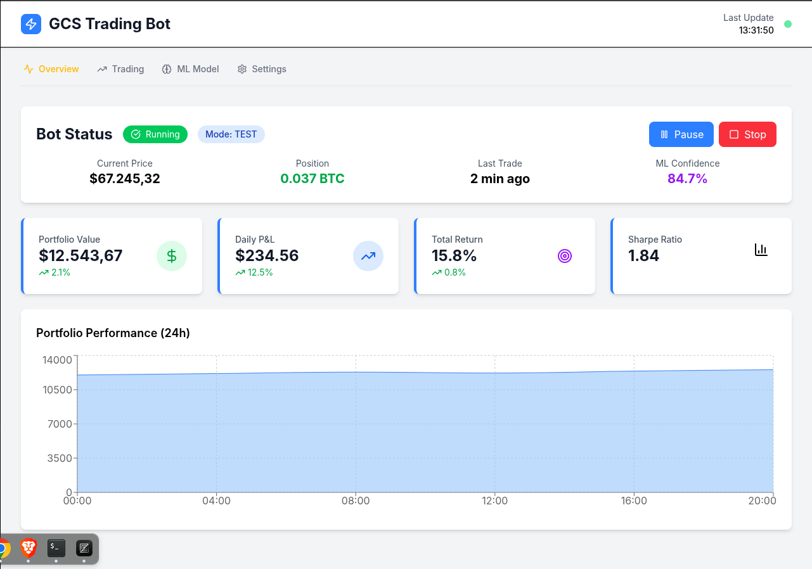
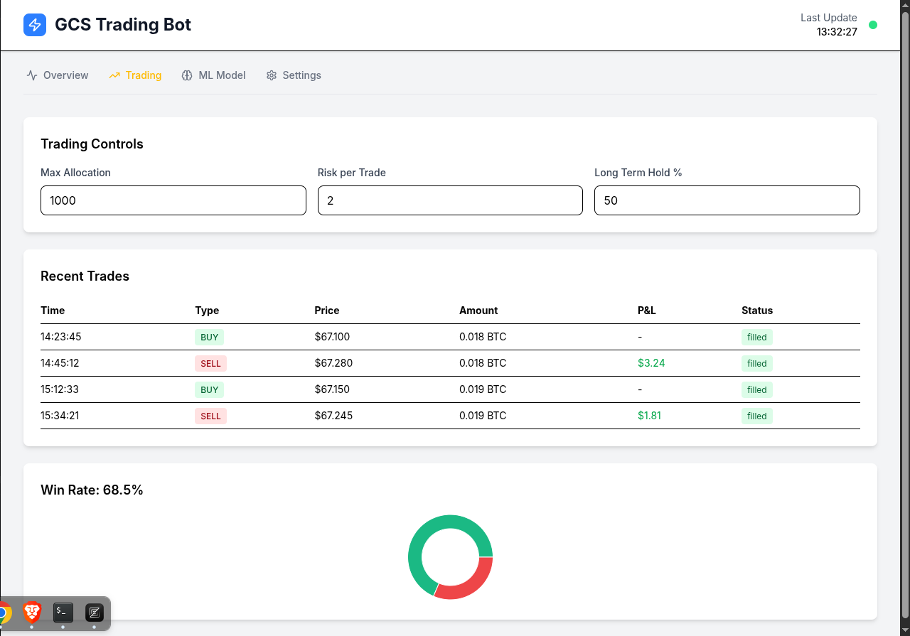
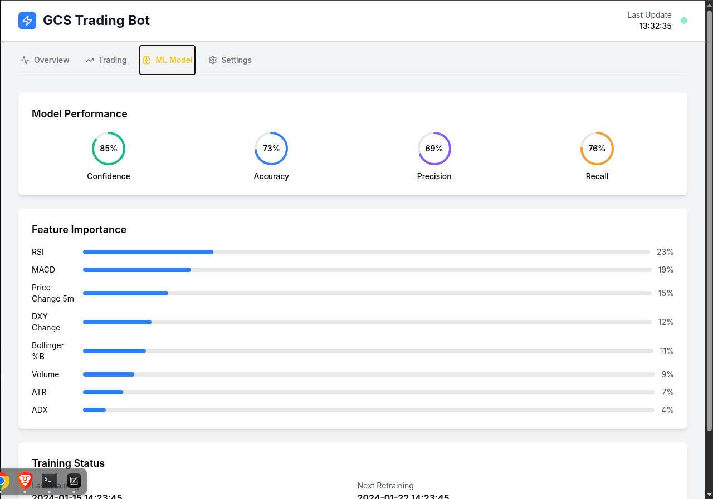
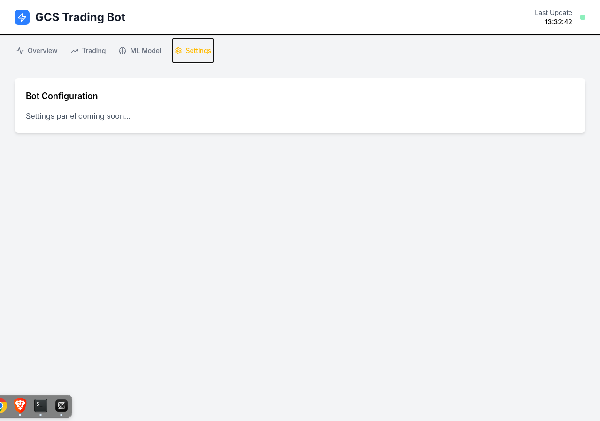

# 🚀 GCS Trading Bot Dashboard

<div align="center">
  

  **Um dashboard moderno e responsivo para monitoramento e controle de bots de trading de criptomoedas**

  *Construído com React, TypeScript e Tailwind CSS*

  [](https://reactjs.org/)
  [](https://www.typescriptlang.org/)
  [](https://tailwindcss.com/)
  [](https://vitejs.dev/)
</div>

---

## 📸 Preview da Aplicação

### Dashboard Principal

*Visão geral com métricas em tempo real e status do bot*

### Painel de Trading

*Controles de trading e histórico de operações*

### Analytics ML

*Performance e métricas do modelo de Machine Learning*

### Settings

*Configurações*

> **Nota**: Para adicionar suas próprias screenshots, salve as imagens na pasta `public/` ou crie uma pasta `docs/images/` no seu repositório.

## ✨ Funcionalidades

### 📊 **Overview**
- Monitoramento em tempo real do status do bot
- Métricas de performance do portfólio
- Gráficos de performance histórica
- Indicadores de confiança do modelo ML

### 💹 **Trading**
- Controles de configuração de trading
- Histórico de trades recentes
- Métricas de win rate
- Configurações de risco e alocação

### 🧠 **Machine Learning**
- Performance do modelo de ML
- Importância das features
- Status de treinamento
- Métricas de precisão e recall

### ⚙️ **Configurações**
- Painel de configurações do bot
- Controles de risco
- Parâmetros de trading

## 🛠️ Tecnologias Utilizadas

- **React 19** - Biblioteca para construção da interface
- **TypeScript** - Tipagem estática para JavaScript
- **Tailwind CSS 4** - Framework CSS utilitário
- **Recharts** - Biblioteca de gráficos para React
- **Lucide React** - Ícones modernos
- **Vite** - Build tool e dev server
- **Axios** - Cliente HTTP para APIs

## 🚀 Como Executar

### Pré-requisitos

- Node.js (versão 18 ou superior)
- npm ou yarn

### Instalação

1. **Clone o repositório**
   ```bash
   git clone https://github.com/seu-usuario/trading-dashboard.git
   cd trading-dashboard
   ```

2. **Instale as dependências**
   ```bash
   npm install
   # ou
   yarn install
   ```

3. **Execute o projeto em modo de desenvolvimento**
   ```bash
   npm run dev
   # ou
   yarn dev
   ```

4. **Acesse a aplicação**
   ```
   http://localhost:5173
   ```

### Build para Produção

```bash
npm run build
# ou
yarn build
```

### Preview da Build

```bash
npm run preview
# ou
yarn preview
```

## 📱 Interface

### Dashboard Principal
- **Status do Bot**: Indicadores visuais do status (Running/Paused/Stopped)
- **Métricas em Tempo Real**: Portfolio value, P&L diário, Sharpe ratio
- **Gráfico de Performance**: Visualização da performance do portfólio nas últimas 24h

### Painel de Trading
- **Controles de Trading**: Configurações de alocação máxima e risco
- **Histórico de Trades**: Lista detalhada das operações recentes
- **Taxa de Acerto**: Visualização gráfica da performance

### Modelo de ML
- **Métricas do Modelo**: Confidence, Accuracy, Precision, Recall
- **Importância das Features**: RSI, MACD, Price Change, etc.
- **Status de Treinamento**: Informações sobre o último treinamento

## 🎨 Design System

### Cores Principais
- **Primary**: Blue (#3B82F6) 
- **Success**: Green (#10B981) 
- **Warning**: Yellow (#F59E0B) 
- **Danger**: Red (#EF4444) 
- **Background**: Gray (#F3F4F6) 

### Ícones e Assets
O projeto utiliza o logo do Vite como placeholder:
- **Logo Principal**: `/vite.svg` 
- **Ícones**: Lucide React para ícones da interface
- **Favicon**: Configurado no `index.html`

### Componentes Visuais
- **MetricCard**: Cartões de métricas com ícones e mudanças percentuais
- **StatusBadge**: Badges de status com cores dinâmicas
- **Navigation**: Sistema de tabs responsivo
- **Charts**: Gráficos integrados com Recharts

### Screenshots das Funcionalidades

**Dashboard Overview:**
- Status do bot em tempo real (Running/Paused/Stopped)
- Métricas: Portfolio ($12,543), P&L ($234), Return (15.8%)
- Gráfico de performance das últimas 24h
- Indicadores de confiança ML (84.7%)

**Trading Panel:**
- Controles: Max Allocation, Risk per Trade, Long Term Hold %
- Tabela de trades recentes com P&L
- Gráfico de pizza mostrando Win Rate (68.5%)

**ML Model Analytics:**
- Métricas circulares: Confidence, Accuracy, Precision, Recall
- Barras de importância das features (RSI, MACD, etc.)
- Status de treinamento do modelo

## 📊 Dados Simulados

O projeto atualmente utiliza dados mock para demonstração:

- **Portfolio Value**: $12,543.67
- **Daily P&L**: $234.56
- **Total Return**: 15.8%
- **Sharpe Ratio**: 1.84
- **Win Rate**: 68.5%
- **ML Confidence**: 84.7%

## 🔌 Integração com APIs

Para conectar com APIs reais, modifique os dados mock em `App.tsx`:

```typescript
// Exemplo de integração com API
const fetchPortfolioData = async () => {
  const response = await axios.get('/api/portfolio');
  return response.data;
};
```

## 📁 Estrutura do Projeto

```
trading-dashboard/
├── public/
│   ├── vite.svg           # Logo do projeto
│   └── docs/
│       └── images/        # Screenshots da aplicação (adicionar)
│           ├── dashboard-overview.png
│           ├── trading-panel.png
│           └── ml-analytics.png
├── src/
│   ├── assets/
│   │   └── react.svg
│   ├── App.tsx          # Componente principal
│   ├── App.css         # Estilos específicos
│   ├── index.css       # Estilos globais
│   ├── main.tsx        # Entry point
│   └── vite-env.d.ts   # Tipos do Vite
├── eslint.config.js    # Configuração ESLint
├── package.json        # Dependências
├── tsconfig.*.json     # Configuração TypeScript
├── vite.config.ts      # Configuração Vite
└── README.md
```

## 📷 Como Adicionar Screenshots

Para adicionar suas próprias capturas de tela da aplicação:

1. **Execute a aplicação localmente**
   ```bash
   npm run dev
   ```

2. **Tire screenshots das diferentes seções**
   - Dashboard Overview (aba Overview)
   - Trading Panel (aba Trading)
   - ML Analytics (aba ML Model)

3. **Salve as imagens**
   ```bash
   # Crie a pasta de documentação
   mkdir -p public/docs/images

   # Adicione suas screenshots
   # dashboard-overview.png
   # trading-panel.png
   # ml-analytics.png
   ```

4. **Atualize as URLs no README**
   - Substitua os caminhos das imagens pelos arquivos reais
   - Use caminhos relativos: `./public/docs/images/nome-da-imagem.png`

## 🔧 Scripts Disponíveis

- `npm run dev` - Inicia o servidor de desenvolvimento
- `npm run build` - Cria build de produção
- `npm run lint` - Executa linting do código
- `npm run preview` - Preview da build de produção

## 📈 Próximas Funcionalidades

- [ ] Integração com APIs de exchanges
- [ ] Notificações em tempo real
- [ ] Histórico de performance extendido
- [ ] Configurações avançadas de ML
- [ ] Modo escuro/claro
- [ ] Export de relatórios
- [ ] Alertas customizáveis
- [ ] Backtesting de estratégias

## 🤝 Contribuindo

1. Faça o fork do projeto
2. Crie uma branch para sua feature (`git checkout -b feature/AmazingFeature`)
3. Commit suas mudanças (`git commit -m 'Add some AmazingFeature'`)
4. Push para a branch (`git push origin feature/AmazingFeature`)
5. Abra um Pull Request

## 📄 Licença

Este projeto está sob a licença MIT. Veja o arquivo [LICENSE](LICENSE) para mais detalhes.

## 👥 Autores

- **GCS Development Team** - *Desenvolvimento inicial*

## 📞 Suporte

Para suporte, envie um email para suporte@gcs.com ou abra uma issue no GitHub.

---

## 🌐 English Version

# 🚀 GCS Trading Bot Dashboard

A modern and responsive dashboard for monitoring and controlling cryptocurrency trading bots, built with React, TypeScript and Tailwind CSS.

### 🎯 Key Features
- **Real-time Bot Monitoring** - Live status tracking and performance metrics
- **Trading Controls** - Risk management and allocation settings
- **ML Model Analytics** - Feature importance and model performance
- **Interactive Charts** - Portfolio performance and win rate visualization

### 🛠️ Tech Stack
React 19 • TypeScript • Tailwind CSS 4 • Recharts • Vite

### 🚀 Quick Start
```bash
git clone https://github.com/your-username/trading-dashboard.git
cd trading-dashboard
npm install
npm run dev
```

Visit `http://localhost:5173` to see the dashboard in action.

---

⭐ If this project was helpful to you, consider giving it a star on GitHub!
